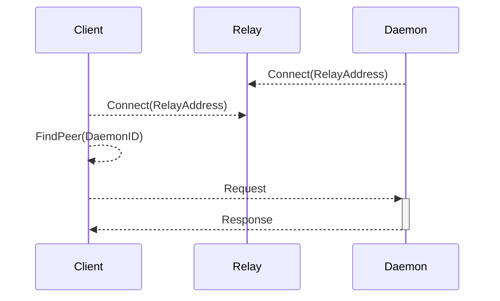

# libp2p-relay

Some projects of Threefold Tech or that Threefold Tech supports rely on [libp2p](https://libp2p.io) peer routing.

This project provides an implementation for relay nodes that can be used to provide reliable peer communication.

## Flow



## Peer propagation

The relay also acts as a server for a DHT with peerconnections, propagating the peers and their connection informations to connected peers.

If a client can reach a daemon directly, the relay is not needed for relaying messages.

## Private network

Since we only care about providing reliable peer routing for our own projects we create a private libp2p network with multiple relay nodes. This way the peer routing's dht is only populated with nodes within the private network.

### PSK

A private network is defined by a 256-bit secret key, the pre-shared key (PSK) which has to be known and used by all members inside the network.

Any 32 (pseudo)random bytes are good, this is an example of how to create a PSK in hex on the commandline:

```sh
hexdump -n 32 -e '8/4 "%08x" 1 "\n"' /dev/urandom
```

### Security

Applications using the relay nodes and private network should NOT assume all traffic and connections are from trusted parties. Pre-shared private keys are known to leak and it is shared with multiple applications.

A leaked PSK is not a problem either as long as the relaying functionality stays reliable. This does not mean one should hardcode it and submit it to a public github repository off course.
