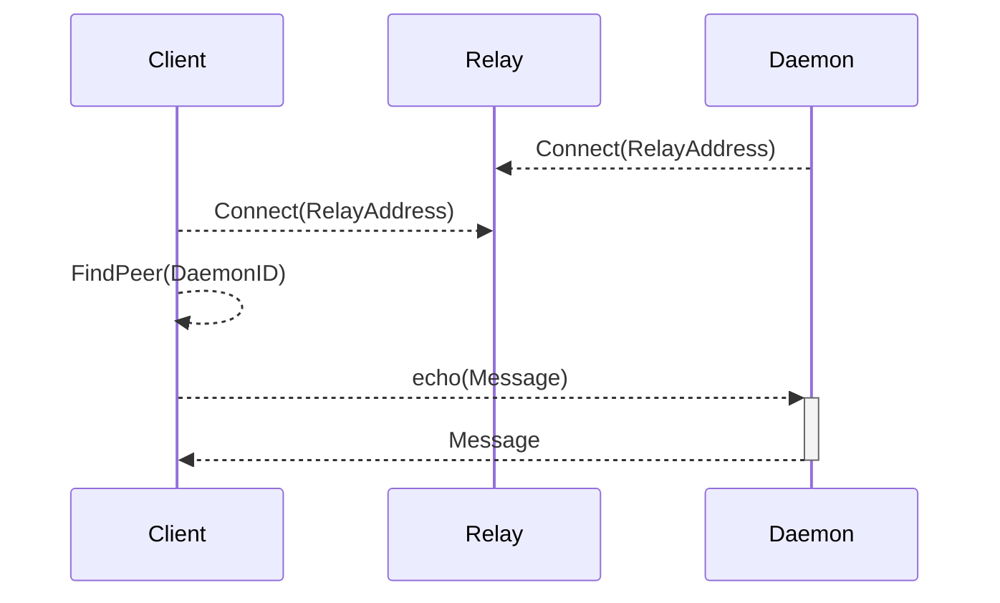

# libp2p-relay echo example

An example where a daemon just echos whatever whatever message it gets.

## Components



## Build

Execute `go build` in the root of this repo(`..`) and in the `echoclient` and `echodaemon` folders.

## Run

Let's take `1ab7e23edf1a951da91cab2d5d77b434936d85fda6bf0fd984e7aed557aab2a0` as a psk.

Start the relay

```sh
../libp2p-relay -psk=1ab7e23edf1a951da91cab2d5d77b434936d85fda6bf0fd984e7aed557aab2a0
```

In another shell, start the damon

```sh
echodaemon/echodaemon -psk=1ab7e23edf1a951da91cab2d5d77b434936d85fda6bf0fd984e7aed557aab2a0 -relay=/ip4/127.0.0.1/tcp/<relay listening port>/p2p/<relay peer ID>
```

In another shell, start the client

```sh
echoclient/echoclient -psk=1ab7e23edf1a951da91cab2d5d77b434936d85fda6bf0fd984e7aed557aab2a0 -relay=/ip4/127.0.0.1/tcp/<relay listening port>/p2p/<relay peer ID> -remote=<daemon peer ID>
```
