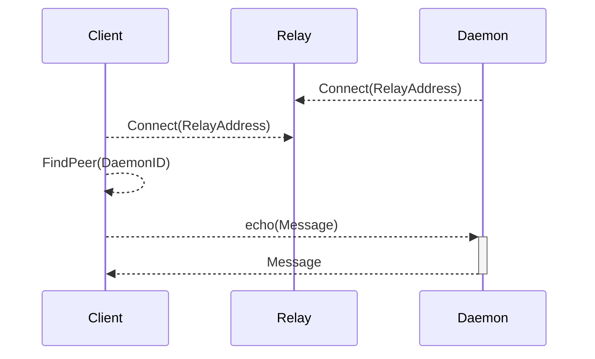

# libp2p-relay echo example

An example where a daemon just echos whatever whatever message it gets.

## Components



## Build

Execute `go build` in the root of this repo(`..`) and in the `echoclient` and `echodaemon` folders.

## Run

Let's take `1ab7e23edf1a951da91cab2d5d77b434936d85fda6bf0fd984e7aed557aab2a0` as a psk.

Let us use an idkey for the relay as well so the p2p ID is deterministic.
`a86c383a07191d0501f6eb6d29bfcc031126e25a64a0ddd632a1b6e0d4a562d2` gives `12D3KooWPo5j8T2fxEGeUmVDtf2gi3mNtypMTfFqzAQYPz5ii7mw` as peer ID.

Start the relay

```sh
../libp2p-relay -psk=1ab7e23edf1a951da91cab2d5d77b434936d85fda6bf0fd984e7aed557aab2a0 -idkey=a86c383a07191d0501f6eb6d29bfcc031126e25a64a0ddd632a1b6e0d4a562d2
```

In another shell, start the daemon

```sh
echodaemon/echodaemon -psk=1ab7e23edf1a951da91cab2d5d77b434936d85fda6bf0fd984e7aed557aab2a0 -relay=/ip4/127.0.0.1/tcp/<relay listening port>/p2p/12D3KooWPo5j8T2fxEGeUmVDtf2gi3mNtypMTfFqzAQYPz5ii7mw
```

In another shell, start the client

```sh
echoclient/echoclient -psk=1ab7e23edf1a951da91cab2d5d77b434936d85fda6bf0fd984e7aed557aab2a0 -relay=/ip4/127.0.0.1/tcp/<relay listening port>/p2p/12D3KooWPo5j8T2fxEGeUmVDtf2gi3mNtypMTfFqzAQYPz5ii7mw -remote=<daemon peer ID>
```

## Run with the daemon not directly acessible by the client

In the above example, the daemon was reachable by the client. The dht propagated the address to client and the communication was done without the relay forwarding the messages.

To simulate a daemon that's inaccessible to the client, add the `-listen=false` flag to the daemon command.
